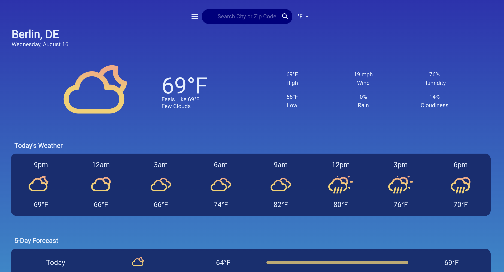

# WeatherHub

WeatherHub is a React-based weather application that provides comprehensive weather details at your fingertips. Utilizing Material-UI for a seamless design and powered by the Open Weather API, it offers various features, from the current weather statistics to 5-day forecasts.



## Table of Contents
- [Features](#features)
- [Technologies Used](#technologies-used)
- [Installation](#installation)
- [Usage](#usage)
- [License](#license)

## Features 
- **Searchable Locations**: Find weather information by city or ZIP code.
- **Local Storage**: Save or delete your favorite locations directly to local storage for quick access.
- **Temperature Unit Toggle**: Switch between Fahrenheit (F) and Celsius (C) effortlessly.
- **Current Weather Details**: View essential details like:
  - Temperature
  - "Feels like" temperature
  - High and low temperature
  - Wind speed
  - Humidity percentage
  - Rain percentage
  - Cloud percentage
- **Full Day Weather Forecast**: Stay informed with an hourly breakdown of the weather.
- **5-Day Weather Forecast**: Includes:
  - Day
  - Weather type icon
  - High and low temperature
  - Gradient scale to visualize the temperature range

  ## Technologies Used
* React.js
* Material-UI
* Open Weather API
* CSS
* react-slick

## Installation

The application is deployed on GitHub Pages. You can access it using the following link: [Git Repository](https://github.com/TurboTeam335/weather-react)

To install the application, follow the steps below:

1. Clone the repository to your local machine
2. Navigate to the cloned repository
3. Install dependencies: ```npm install```
4. Start the application: ```npm start```

  

The application will be available on `http://localhost:3000/`.

## Usage

You can access the deployed site using the following link: [WeatherHub
](https://turboteam335.github.io/weather-react/)

- Use the search box to search for a city or zip
- Be able to view the weather plus the forecast up to 5 days
- To the right of the search bar give you the ability to switch between Fahrenheit (F) and Celsius (C)
- To the left be able to view or delete previous cities you have searched for 

## License

[MIT](https://choosealicense.com/licenses/mit/)